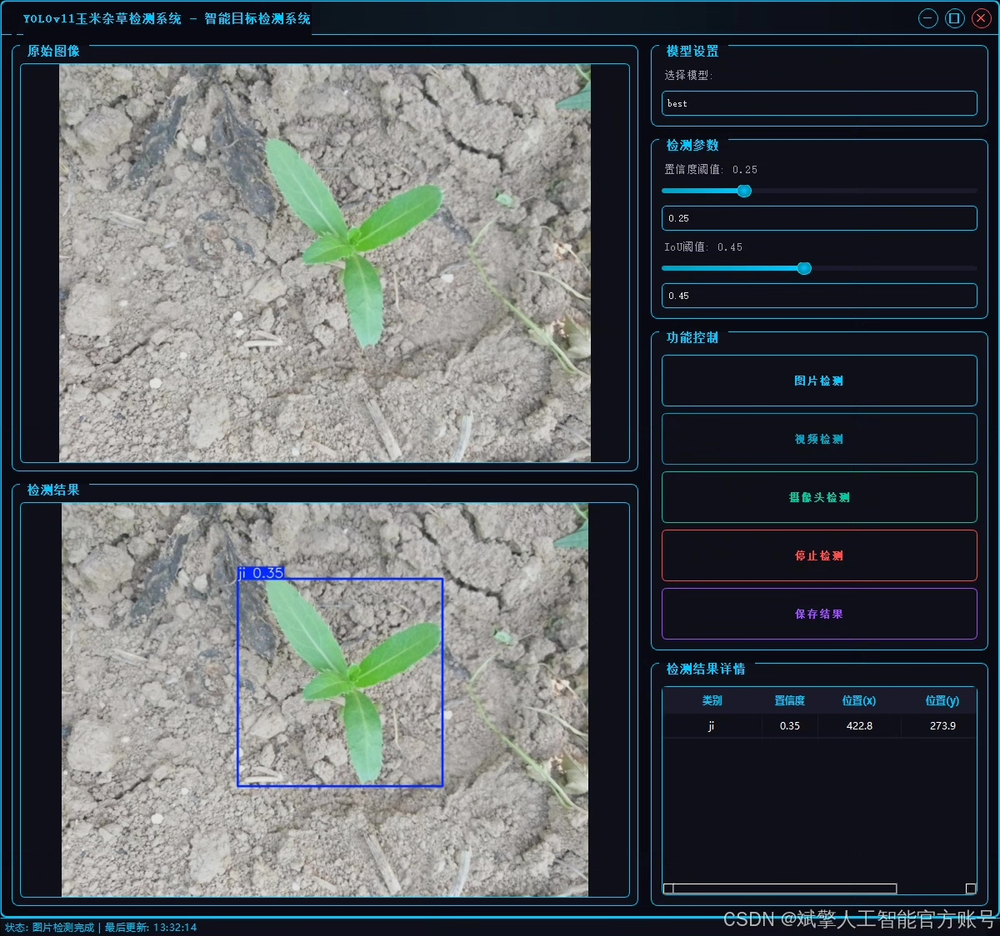
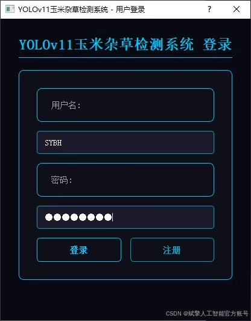
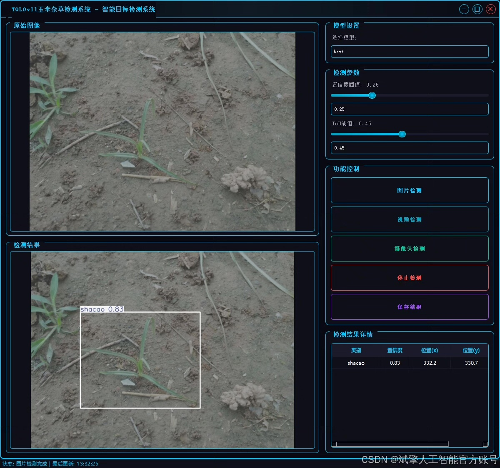
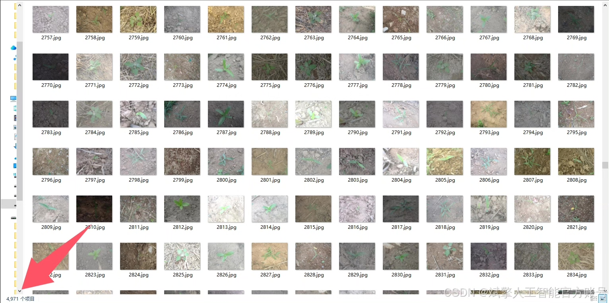
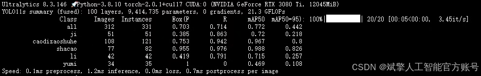
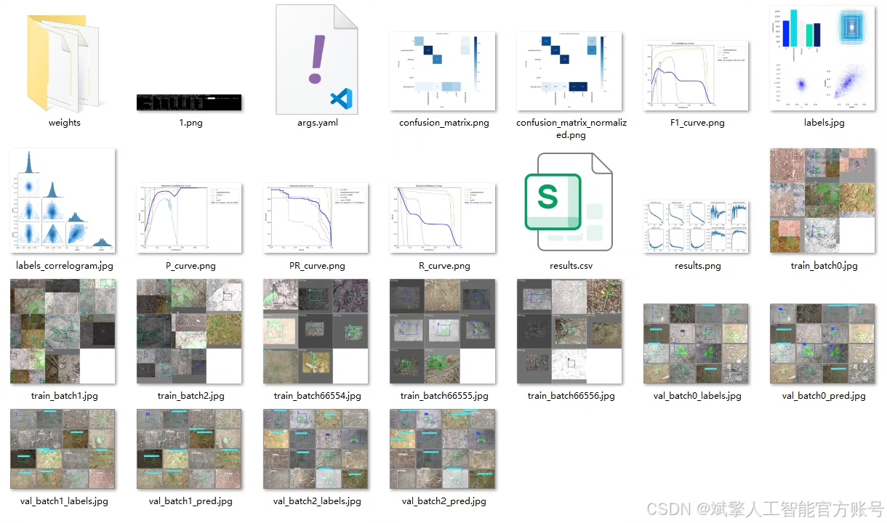
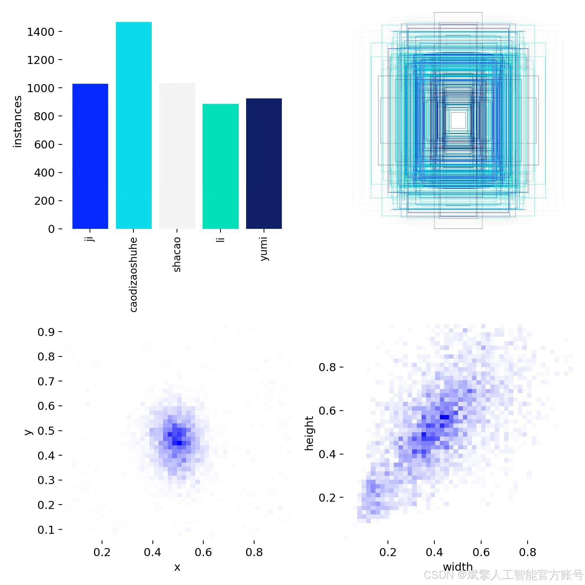
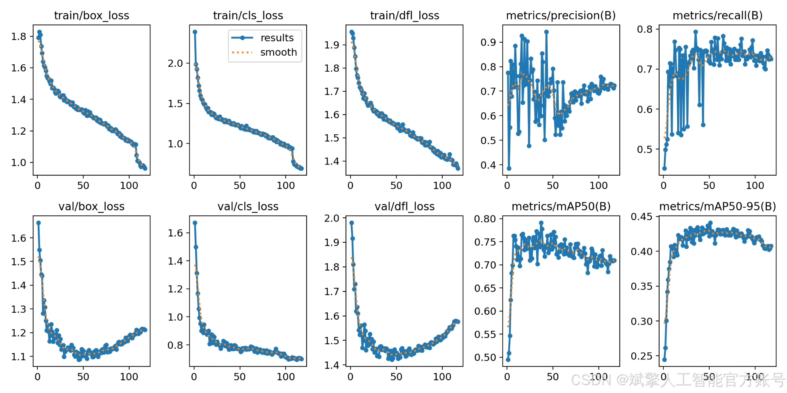
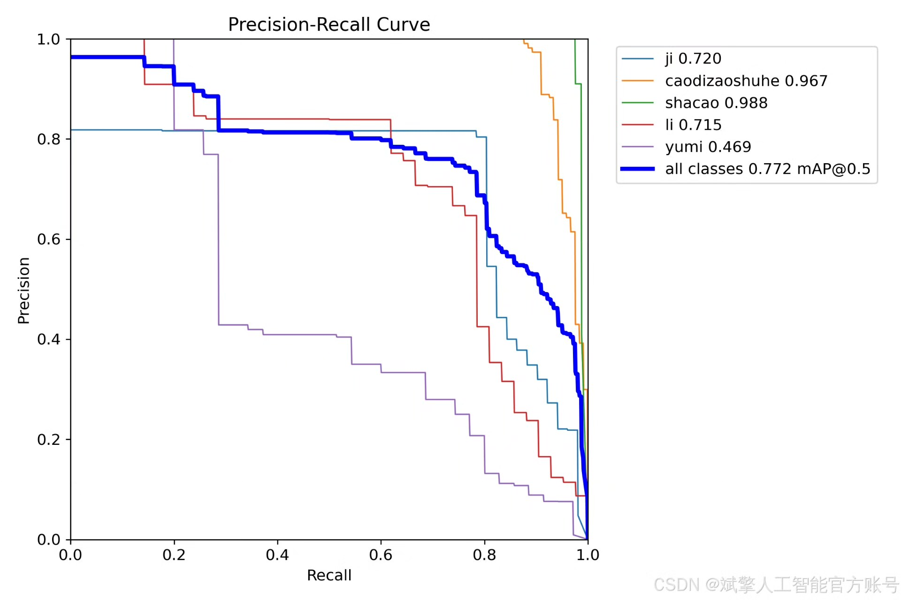

# YOLOv11 weed recognition system

## Body

YOLOv11 Weed Identification System Based on Deep Learning YOLOv11: A Weed Identification Detection System (YOLOv11+YOLO dataset + UI interface + login and registration interface + Python project source code + model)

nc: 5 classes,
Names: ['ji', 'caodizaoshuhe', 'shacao', 'li', 'yumi'],
Dataset quantity: training set 4971 images, validation set 312 images.

✅ User Login and Registration: Support password detection and security verification.

✅ Three detection modes: based on the YOLOv11 model, support image, video, and real-time camera three detection, accurate recognition of targets.

✅ Dual-screen comparison: display original images and detection results in the same screen.

✅ Data visualization: real-time table displaying the category, confidence, and coordinates of detected targets.

✅ Intelligent parameter adjustment: provide a confidence slide bar to dynamically optimize detection accuracy, adapt to different scene requirements.

✅ Sci-fi style interactive interface: dark theme combined with dynamic light effects, reduce visual fatigue, improve operational experience.

## Images

## Payment

Here is a pay link on Stripe ( https://buy.stripe.com/3cs8yP7sY87d0vu9AB ). Please contact me lonlonago@foxmail.com after funding $89, and I will send you a complete data files , thank you!

